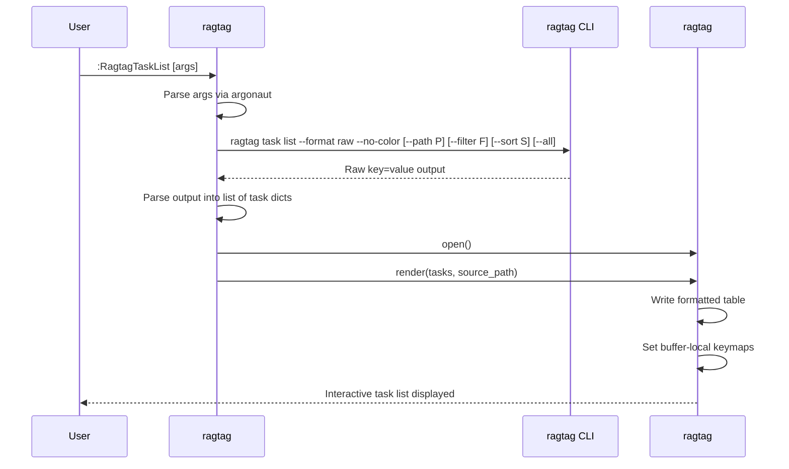
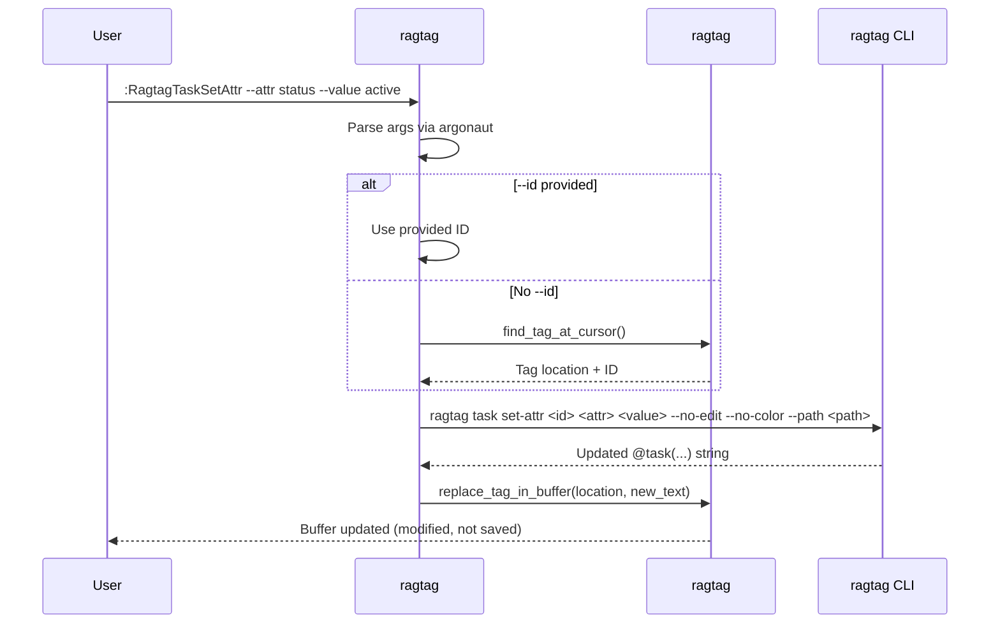
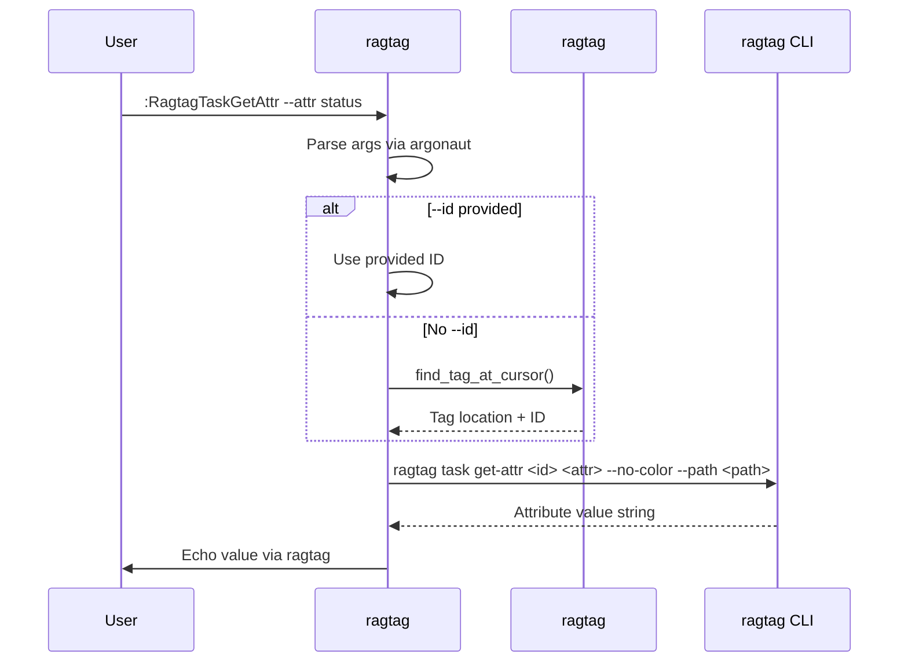
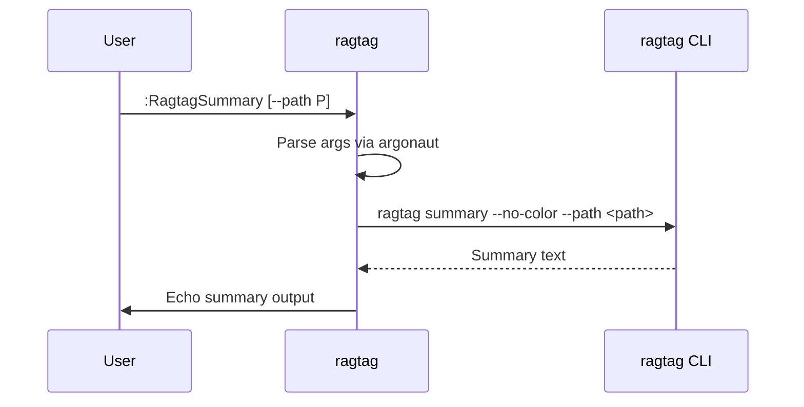

# ragtag.vim — Architecture

This document describes the architecture of `ragtag.vim`, a Vim plugin that provides an interactive interface to the [ragtag](../ragtag/) CLI tool.
The plugin allows users to list, query, inspect, and modify `@tag(...)` annotations — and specifically `@task(...)` tags — directly from within Vim.

## Overview

### Problem Statement

The `ragtag` CLI tool scans plain text files for `@tag(attr=value)` syntax and provides commands to list, query, and modify tags.
Its `task` extension treats `@task(...)` tags as structured task items with attributes like `id`, `title`, `owner`, `status`, `priority`, etc.

While the CLI is powerful, switching between the editor and the terminal to manage tasks is cumbersome.
`ragtag.vim` bridges this gap by embedding ragtag's functionality directly into Vim, offering:

* An interactive task list buffer with inline attribute editing
* Cursor-aware tag detection and modification
* Tag querying with search-register integration for navigation
* File summary display

### Dependencies

* **ragtag CLI** — the plugin shells out to the `ragtag` binary for all tag operations; it does not reimplement parsing logic
* **argonaut.vim** — the plugin uses [argonaut.vim](https://github.com/cwshugg/argonaut.vim) for argument parsing and tab completion on all commands

### Target Users

Vim users who use `ragtag` to manage tasks and tags in plain text files (Markdown, plain text, code comments, etc.).

## Directory Structure

```
ragtag.vim/
├── plugin/
│   └── ragtag.vim              # Load guard, dependency checks, command definitions
├── autoload/
│   └── ragtag/
│       ├── commands.vim         # Command implementations + argonaut arg definitions
│       ├── utils.vim            # Messaging, shell helpers, utility functions
│       ├── config.vim           # g:ragtag_* configuration variable defaults
│       ├── tag.vim              # Tag parsing/detection in buffer text
│       ├── buffer.vim           # Task list buffer management
│       └── highlight.vim        # Highlight group definitions
├── syntax/
│   └── ragtag_list.vim          # Syntax highlighting for the task list buffer
├── doc/
│   └── ragtag.txt               # Vim help documentation
└── docs/
    └── architecture.md          # This file
```

## Module Descriptions

### `plugin/ragtag.vim` — Entry Point

This file is sourced once when Vim starts (or when the plugin is loaded).
It is responsible for:

1. **Load guard** — prevents double-loading via the `g:loaded_ragtag` variable
2. **Dependency check** — verifies that `argonaut.vim` is available; prints an error and aborts if not
3. **Command definitions** — defines all user-facing `:commands` using `command!`, delegating to `ragtag#commands#*` functions
4. **Command aliases** — defines short aliases (e.g., `:Rtl` for `:RagtagTaskList`)

#### Command Registration Pattern

Every command follows the same pattern:

```vim
command!
    \ -nargs=*
    \ -complete=customlist,ragtag#commands#<name>_complete
    \ RagtagCommandName
    \ call ragtag#commands#<name>(<q-args>)
```

#### Commands Registered

| Command | Alias | Function | Description |
|---------|-------|----------|-------------|
| `RagtagTaskList` | `Rtl` | `ragtag#commands#task_list()` | Show interactive task list |
| `RagtagTaskCreate` | `Rtcr` | `ragtag#commands#task_create()` | Create and insert a `@task(...)` tag |
| `RagtagTaskSetAttr` | `Rtsa` | `ragtag#commands#task_set_attr()` | Set a task attribute |
| `RagtagTaskGetAttr` | `Rtga` | `ragtag#commands#task_get_attr()` | Get a task attribute |
| `RagtagTaskComplete` | `Rtco` | `ragtag#commands#task_complete()` | Mark a task as done |
| `RagtagTaskActivate` | `Rta` | `ragtag#commands#task_activate()` | Set a task's status to active |
| `RagtagTaskDeactivate` | `Rtd` | `ragtag#commands#task_deactivate()` | Set a task's status to inactive |
| `RagtagTaskBlock` | `Rtb` | `ragtag#commands#task_block()` | Set a task's status to blocked |
| `RagtagTaskAbandon` | `Rtab` | `ragtag#commands#task_abandon()` | Set a task's status to abandoned |
| `RagtagTaskPrioritize` | `Rtp` | `ragtag#commands#task_prioritize()` | Set a task's priority |
| `RagtagSummary` | `Rs` | `ragtag#commands#summary()` | Show tag summary |
| `RagtagQuery` | `Rq` | `ragtag#commands#query()` | Find and highlight tags |

### `autoload/ragtag/commands.vim` — Command Implementations

This is the largest module. It contains:

1. **Argonaut argument definitions** — file-scope `s:arg_*` variables for each command's arguments, assembled into `s:*_argset` objects
2. **Tab completion functions** — `ragtag#commands#<name>_complete()` for each command
3. **Command handler functions** — `ragtag#commands#<name>()` for each command

Each command handler follows this pattern:

```vim
function! ragtag#commands#<name>(input) abort
    let l:parser = argonaut#argparser#new(s:<name>_argset)
    try
        call argonaut#argparser#parse(l:parser, a:input)
        if argonaut#argparser#has_arg(l:parser, '--help')
            call argonaut#argparser#show_help(l:parser)
            return
        endif
        " ... command-specific logic ...
    catch
        call ragtag#utils#print_error(v:exception)
    endtry
endfunction
```

### `autoload/ragtag/utils.vim` — Utilities

Messaging and shell execution helpers.

#### Messaging Functions

```vim
" Prints an informational message prefixed with g:ragtag_print_prefix.
function! ragtag#utils#print(msg) abort

" Prints an error message in ErrorMsg highlight.
function! ragtag#utils#print_error(msg) abort

" Throws a prefixed exception (for use in try/catch flows).
function! ragtag#utils#panic(msg) abort
```

#### Shell Helpers

```vim
" Builds a ragtag CLI command string from a list of arguments.
" Prepends the configured binary path (g:ragtag_binary).
" Always appends '--no-color'.
" If g:ragtag_config is set, appends '--config <path>'.
" Returns the full command string.
function! ragtag#utils#build_command(args) abort

" Executes a ragtag CLI command via system().
" Calls ragtag#utils#build_command() to construct the command string.
" Checks v:shell_error and throws on non-zero exit.
" Returns the raw stdout string on success.
function! ragtag#utils#exec(args) abort
```

### `autoload/ragtag/config.vim` — Configuration

Defines all `g:ragtag_*` configuration variables with defaults.
Uses the standard pattern of checking `exists()` before setting, so users can override in their `vimrc`.

See the [Configuration](#configuration) section for the full list of variables.

### `autoload/ragtag/tag.vim` — Tag Detection

Reusable tag parsing module for detecting and manipulating `@tag(...)` strings in buffer text.

#### Key Functions

```vim
" Finds the tag boundaries at or near the cursor position.
" Scans backward from cursor to find '@tagname(' start, then forward
" to find matching ')' (handling nested parentheses and multi-line tags).
" Returns a dict:
"   {
"     'start_line': N,
"     'start_col': N,
"     'end_line': N,
"     'end_col': N,
"     'tag_name': 'task',
"     'raw_text': '@task(...)',
"     'id': '...'
"   }
" Throws an error if no tag is found at or near the cursor.
function! ragtag#tag#find_tag_at_cursor() abort
```

```vim
" Parses a raw tag string into a dict of attributes.
" Input: '@task(id=abc, title=My Task, status=active)'
" Returns: {'name': 'task', 'attrs': {'id': 'abc', 'title': 'My Task', ...}}
function! ragtag#tag#parse_tag_string(text) abort
```

```vim
" Replaces a tag in the buffer at the given location with new text.
" Handles multi-line tags by replacing from start_line:start_col
" to end_line:end_col.
" Sets the buffer to modifiable during the replacement, then restores.
function! ragtag#tag#replace_tag_in_buffer(location, new_text) abort
```

#### Tag Detection Algorithm

The `find_tag_at_cursor()` function works as follows:

1. Get the cursor position (`line('.')`, `col('.')`)
2. Get the text of the current line
3. Scan backward from the cursor column looking for `@` followed by a word character — this is the tag name start
4. If not found on the current line, scan previous lines (up to a configurable limit) looking for an unclosed `@tagname(` pattern
5. Once the `@` is found, scan forward from that position to find the tag name (letters, digits, underscores)
6. Continue scanning forward to find the opening `(`
7. Track parenthesis depth to find the matching `)`, handling:
    * Nested parentheses (depth tracking)
    * Quoted strings (skip contents of `"..."` including escaped quotes)
    * Multi-line tags (continue across line boundaries)
8. Extract the full raw text from start to end position
9. Extract the `id` attribute if present (for `@task` tags)
10. Return the location dict

### `autoload/ragtag/buffer.vim` — Task List Buffer

Manages the interactive task list scratch buffer.

#### Key Functions

```vim
" Opens or reuses the task list buffer.
" Creates a new scratch buffer if one doesn't exist, or switches to
" the existing one. Sets buffer options and filetype.
function! ragtag#buffer#open() abort
```

```vim
" Renders task data into the task list buffer.
" Takes a list of task dicts (parsed from CLI output) and formats
" them as aligned table rows. Sets up buffer-local key mappings.
" a:tasks - list of task dicts from ragtag#commands#parse_task_list_output()
" a:source_path - the --path that was used (for refresh)
function! ragtag#buffer#render(tasks, source_path) abort
```

```vim
" Returns the task dict for the line under the cursor in the
" task list buffer. Returns an empty dict if the cursor is on
" a header or separator line.
function! ragtag#buffer#get_task_at_cursor() abort
```

```vim
" Prompts the user to edit an attribute of the task under the cursor.
" Shows the current value, accepts new input, calls set-attr via CLI,
" and replaces the tag in the source file buffer.
" a:attr - attribute name (e.g., 'status', 'priority')
function! ragtag#buffer#edit_attr(attr) abort
```

```vim
" Jumps to the source file and line of the task under the cursor.
" Opens the file in the previous window (wincmd p).
function! ragtag#buffer#jump_to_task() abort
```

```vim
" Refreshes the task list by re-running the CLI command
" with the same arguments used on the last render.
function! ragtag#buffer#refresh() abort
```

#### Buffer Properties

The task list buffer is created with the following settings:

| Setting | Value | Purpose |
|---------|-------|---------|
| `buftype` | `nofile` | Not associated with a file |
| `bufhidden` | `wipe` | Wiped when hidden |
| `swapfile` | `off` | No swap file |
| `modifiable` | `off` (except during writes) | Read-only |
| `filetype` | `ragtag_list` | Triggers syntax highlighting |
| `buflisted` | `off` | Hidden from buffer list |

#### Task List Rendering

The buffer displays tasks in a formatted table:

```
 ID        │ Title            │ Owner  │ Pri │ Status  │ File
───────────┼──────────────────┼────────┼─────┼─────────┼──────────────
 a1b2c3d4  │ Design API       │ alice  │ 1   │ active  │ docs/tasks.md:42
 fedcba09  │ Deploy           │ bob    │ 3   │ new     │ notes.md:15
```

* The ID column shows a truncated prefix (first 8 characters) for readability; the full ID is stored in a buffer-local list for lookups
* Columns are right-padded to align based on the widest value in each column
* The header and separator lines are rendered first, followed by one line per task

### `autoload/ragtag/highlight.vim` — Highlight Groups

Defines all custom highlight groups using `highlight default` so users can override them.

See the [Highlight Groups](#highlight-groups) section for the full list.

#### Key Function

```vim
" Defines all ragtag highlight groups.
" Called during plugin load and can be re-called after colorscheme changes.
function! ragtag#highlight#define() abort
```

### `syntax/ragtag_list.vim` — Task List Syntax

Syntax highlighting definitions for the `ragtag_list` filetype.
This file is automatically sourced when a buffer's filetype is set to `ragtag_list`.

It defines syntax matches for:

* Header text and separator lines
* Task ID column
* Priority values (colored by urgency)
* Status values (colored by category)
* File paths and line numbers
* Column separators (`│`)

## Command Specifications

### `RagtagTaskList` (alias: `Rtl`)

**Purpose:** Display all tasks in a custom interactive buffer with inline editing capabilities.

#### Arguments

| Argument | Short | Type | Default | Description |
|----------|-------|------|---------|-------------|
| `--path` | `-p` | String | Current file | File or directory to search |
| `--filter` | `-f` | String | *(none)* | Filter expression (e.g., `status=active`) |
| `--sort` | `-s` | String | `priority` | Field to sort by |
| `--all` | `-a` | Boolean | `false` | Include done/abandoned tasks |
| `--help` | `-h` | Boolean | `false` | Show help menu |

#### Behavior



#### Output Parsing

The CLI is invoked with `--format raw`, which produces key=value output with blank-line delimiters between tasks:

```
id=a1b2c3d4e5f67890
title=Design API
owner=alice
status=active
priority=1
description=Design the REST API
file=/path/to/file.md
line=42
worktime_spent=
worktime_estimate=8
worktime_units=hours
time_created=2024-01-15T09:00:00Z
time_last_updated=2024-01-20T14:30:00Z
pid=
```

The plugin parses this into a list of Vim dictionaries, one per task.

#### Error Handling

* If the CLI binary is not found, print an error via `ragtag#utils#print_error()`
* If the CLI returns a non-zero exit code, display the stderr output as an error
* If no tasks are found, display an informational message in the buffer

### `RagtagTaskSetAttr` (alias: `Rtsa`)

**Purpose:** Set an attribute on a task, either under the cursor or by explicit ID.

#### Arguments

| Argument | Short | Type | Default | Description |
|----------|-------|------|---------|-------------|
| `--id` | `-i` | String | *(cursor detection)* | Task ID (overrides cursor detection) |
| `--attr` | `-a` | String | *(required)* | Attribute name |
| `--value` | `-v` | String | *(required)* | New attribute value |
| `--path` | `-p` | String | Current file | Search path |
| `--help` | `-h` | Boolean | `false` | Show help menu |

#### Behavior



#### Error Handling

* If no `--id` and no tag found at cursor, print an error
* If `--attr` or `--value` is missing, print usage via argonaut help
* If the CLI rejects the attribute/value (e.g., invalid status), display the CLI error

### `RagtagTaskGetAttr` (alias: `Rtga`)

**Purpose:** Retrieve and display a single attribute value from a task.

#### Arguments

| Argument | Short | Type | Default | Description |
|----------|-------|------|---------|-------------|
| `--id` | `-i` | String | *(cursor detection)* | Task ID |
| `--attr` | `-a` | String | *(required)* | Attribute name |
| `--path` | `-p` | String | Current file | Search path |
| `--help` | `-h` | Boolean | `false` | Show help menu |

#### Behavior



#### Error Handling

* Same cursor/ID resolution errors as `RagtagTaskSetAttr`
* If the attribute name is unknown, display the CLI error

### `RagtagSummary` (alias: `Rs`)

**Purpose:** Display a summary of tags found in the current file or directory.

#### Arguments

| Argument | Short | Type | Default | Description |
|----------|-------|------|---------|-------------|
| `--path` | `-p` | String | Current file | File or directory to summarize |
| `--help` | `-h` | Boolean | `false` | Show help menu |

#### Behavior



#### Error Handling

* CLI binary or path errors are caught and displayed

### `RagtagQuery` (alias: `Rq`)

**Purpose:** Find tags in the current buffer and set up Vim search highlighting for navigation.

#### Arguments

| Argument | Short | Type | Default | Description |
|----------|-------|------|---------|-------------|
| `--tag` | `-t` | String | *(all tags)* | Tag name to search for |
| `--path` | `-p` | String | Current file | File to query |
| `--help` | `-h` | Boolean | `false` | Show help menu |

#### Behavior

```mermaid
sequenceDiagram
    participant User
    participant Plugin as ragtag#commands
    participant CLI as ragtag CLI
    participant Vim

    User->>Plugin: :RagtagQuery [--tag task]
    Plugin->>Plugin: Parse args via argonaut
    Plugin->>CLI: ragtag query [TAG_NAME] --no-color --path <path>
    CLI-->>Plugin: List of matching tags with file:line info
    Plugin->>Plugin: Build regex pattern from tag strings
    Plugin->>Vim: Set @/ register to pattern
    Plugin->>Vim: set hlsearch
    Plugin->>Vim: Apply custom highlight groups
    Vim-->>User: Tags highlighted; navigate with n/N
```

#### Highlight Behavior

When highlighting tags in the source buffer:

* The `@` sigil, tag name, parentheses, attribute names, `=` signs, and values each receive distinct highlight groups
* When querying all tags (no `--tag` argument), each unique tag name receives a cycling color to visually distinguish different tag types

#### Error Handling

* If the CLI finds no matching tags, print an informational message
* If `--tag` is specified and no tags of that name exist, print a message

### Status-Change Commands (`RagtagTaskComplete`, `RagtagTaskActivate`, `RagtagTaskDeactivate`, `RagtagTaskBlock`, `RagtagTaskAbandon`)

**Purpose:** Set a task's `status` to a category-canonical keyword in a single command, without having to type the keyword. Each command maps to the matching `ragtag task <verb>` CLI subcommand:

| Vim Command | Alias | CLI Subcommand | Resulting Status |
|-------------|-------|----------------|------------------|
| `RagtagTaskComplete` | `Rtco` | `task complete` | First keyword in `status_keywords.done` (default `"done"`) |
| `RagtagTaskActivate` | `Rta` | `task activate` | First keyword in `status_keywords.active` (default `"active"`) |
| `RagtagTaskDeactivate` | `Rtd` | `task deactivate` | First keyword in `status_keywords.inactive` (default `"inactive"`) |
| `RagtagTaskBlock` | `Rtb` | `task block` | First keyword in `status_keywords.blocked` (default `"blocked"`) |
| `RagtagTaskAbandon` | `Rtab` | `task abandon` | First keyword in `status_keywords.abandoned` (default `"abandoned"`) |

#### Arguments (all five commands)

| Argument | Short | Type | Default | Description |
|----------|-------|------|---------|-------------|
| `--id` | `-i` | String | *(cursor detection)* | Task ID (or unambiguous prefix) — overrides cursor detection |
| `--path` | `-p` | String | Current file | Search path for the CLI |
| `--help` | `-h` | Boolean | `false` | Show help menu |

#### Behavior

1. Parse arguments via argonaut.
2. Resolve the target task ID — either from `--id` or, when absent, from `ragtag#tag#find_tag_at_cursor()`.
3. Invoke `ragtag task <verb> <id> --no-edit --no-color --path <path>`. The CLI returns the reconstructed `@task(...)` string (with `time_last_updated` refreshed to the current UTC time).
4. Replace the tag at its source location in the buffer via `ragtag#tag#replace_tag_in_buffer()`.

#### Error Handling

* If `--id` is omitted and no `@task(...)` tag is found at the cursor, an error is printed.
* If the CLI rejects the operation (e.g., the configured `status_keywords` category is empty), the CLI's stderr is displayed.

### `RagtagTaskPrioritize` (alias: `Rtp`)

**Purpose:** Set a task's `priority` to a specific non-negative integer.

#### Arguments

| Argument | Short | Type | Default | Description |
|----------|-------|------|---------|-------------|
| `--priority` | `-P` | Integer | *(required)* | New priority value (`0` = highest) |
| `--id` | `-i` | String | *(cursor detection)* | Task ID (or unambiguous prefix) |
| `--path` | `-p` | String | Current file | Search path for the CLI |
| `--help` | `-h` | Boolean | `false` | Show help menu |

#### Behavior

1. Parse arguments via argonaut.
2. Validate that `--priority` is supplied and is a non-negative integer.
3. Resolve the target task ID (via `--id` or cursor detection).
4. Invoke `ragtag task prioritize <priority> <id> --no-edit --no-color --path <path>`. Note the CLI's argument order: **priority first, then ID**.
5. Replace the tag in the buffer with the CLI's reconstructed string (which also has `time_last_updated` refreshed).

#### Error Handling

* Missing or invalid `--priority` is reported via argonaut's help output.
* Cursor/ID resolution errors mirror those of `RagtagTaskSetAttr`.

### `RagtagTaskCreate` (alias: `Rtcr`)

**Purpose:** Create a new `@task(...)` tag non-interactively and insert it into the current buffer.

#### Arguments

| Argument | Short | Type | Default | Description |
|----------|-------|------|---------|-------------|
| `--title` | `-T` | String | *(required)* | Task title |
| `--description` | `-D` | String | *(none)* | Task description |
| `--owner` | `-O` | String | *(CLI default)* | Task owner |
| `--status` | `-S` | String | *(CLI default)* | Initial status |
| `--priority` | `-P` | Integer | *(none)* | Priority value (`0` = highest) |
| `--worktime-estimate` | `-E` | Number | *(none)* | Estimated work time |
| `--worktime-spent` | `-W` | Number | `0` | Work time already spent |
| `--worktime-units` | `-U` | String | *(CLI default)* | Units: `hours`, `days`, or `weeks` |
| `--pid` |  | String | *(none)* | Parent task ID |
| `--path` | `-p` | String | Current file | Search path forwarded to the CLI |
| `--help` | `-h` | Boolean | `false` | Show help menu |

#### Behavior

1. Parse arguments via argonaut. Reject if `--title` is missing.
2. Invoke `ragtag task create` with all provided fields, plus `--format multiline` and `--no-color`. The CLI prints a complete `@task(...)` string with `id`, `time_created`, `time_last_updated`, and a default `worktime_spent=0` already filled in.
3. Indent every line of the returned tag to match the indentation of the current cursor line (so that the multiline tag visually aligns with surrounding content).
4. Insert the indented tag into the buffer **after** the cursor line via `append()`.

The command is intentionally non-interactive — the CLI's interactive `task create` mode runs on a TTY and is not used from inside Vim. To capture a task interactively, run `ragtag task create` in a terminal and paste the result.

#### Error Handling

* Missing `--title` produces argonaut's usage output.
* CLI errors (invalid status keyword, invalid worktime units, etc.) are surfaced via `ragtag#utils#print_error()`.

## Configuration

All configuration variables are defined in `autoload/ragtag/config.vim` with sensible defaults.
Users can override any variable in their `vimrc` before the plugin loads.

| Variable | Type | Default | Description |
|----------|------|---------|-------------|
| `g:ragtag_binary` | String | `'ragtag'` | Path to the `ragtag` CLI binary |
| `g:ragtag_config` | String | `''` | Path to ragtag config file; empty string means auto-detect |
| `g:ragtag_default_path` | String | `''` | Default `--path` value; empty string means use the current buffer's file |
| `g:ragtag_print_prefix` | String | `'[ragtag.vim] '` | Prefix for all plugin messages |

### Configuration Loading Pattern

```vim
" In autoload/ragtag/config.vim:
if !exists('g:ragtag_binary')
    let g:ragtag_binary = 'ragtag'
endif
" ... etc. for each variable
```

The config module is sourced via autoload the first time any `ragtag#config#*` function is called.
However, because the variables are global (`g:`), they are also accessible as soon as any autoload file in the `ragtag/` namespace triggers loading.

## Highlight Groups

All highlight groups use `highlight default` so users can override them in their `vimrc` or colorscheme.

### Source Buffer Highlights (for `RagtagQuery`)

| Group | Default Link/Color | Applied To |
|-------|--------------------|------------|
| `RagtagTagSigil` | `Special` | The `@` character |
| `RagtagTagName` | `Identifier` | The tag name (e.g., `task`) |
| `RagtagTagParen` | `Delimiter` | The `(` and `)` delimiters |
| `RagtagAttrName` | `Type` | Attribute names (e.g., `id`, `status`) |
| `RagtagAttrEquals` | `Operator` | The `=` sign |
| `RagtagAttrValue` | `String` | Attribute values |

### Task List Buffer Highlights (for `RagtagTaskList`)

| Group | Default Link/Color | Applied To |
|-------|--------------------|------------|
| `RagtagListHeader` | `Title` | Column headers |
| `RagtagListSeparator` | `NonText` | Separator lines (`───┼───`) |
| `RagtagListId` | `Constant` | Task ID column |
| `RagtagListTitle` | `Normal` | Task title column |
| `RagtagListOwner` | `Identifier` | Owner column |
| `RagtagListStatusDone` | `DiffAdd` (green) | Status = done |
| `RagtagListStatusActive` | `DiffChange` (yellow) | Status = active |
| `RagtagListStatusBlocked` | `ErrorMsg` (red) | Status = blocked |
| `RagtagListStatusAbandoned` | `WarningMsg` (orange) | Status = abandoned |
| `RagtagListStatusInactive` | `Comment` (gray) | Status = new/inactive |
| `RagtagListPriority0` | `ErrorMsg` (red) | Priority 0 (critical) |
| `RagtagListPriority1` | `WarningMsg` (orange) | Priority 1 (high) |
| `RagtagListPriority2` | `Todo` (yellow) | Priority 2 (medium-high) |
| `RagtagListPriority3` | `DiffChange` (yellow-green) | Priority 3 (medium) |
| `RagtagListPriority4` | `DiffAdd` (green) | Priority 4+ (low) |
| `RagtagListFile` | `Directory` | File path column |
| `RagtagListColumnSep` | `NonText` | Column separator character (`│`) |

## Key Mappings

### Task List Buffer Mappings

All mappings are buffer-local (`<buffer>`) and set only within the `ragtag_list` buffer.

| Key | Action | Description |
|-----|--------|-------------|
| `<CR>` | `ragtag#buffer#jump_to_task()` | Jump to the task's source file and line in the previous window |
| `s` | `ragtag#buffer#edit_attr('status')` | Prompt to change the task's status |
| `p` | `ragtag#buffer#edit_attr('priority')` | Prompt to change the task's priority |
| `o` | `ragtag#buffer#edit_attr('owner')` | Prompt to change the task's owner |
| `t` | `ragtag#buffer#edit_attr('title')` | Prompt to change the task's title |
| `d` | `ragtag#buffer#edit_attr('description')` | Prompt to change the task's description |
| `q` | Close the task list buffer (`:bwipeout`) | Close the task list |
| `r` | `ragtag#buffer#refresh()` | Refresh the task list by re-running the CLI |

### Attribute Editing Flow

When the user presses an attribute key (e.g., `s` for status):

1. `ragtag#buffer#edit_attr('status')` is called
2. The function reads the task dict for the current line via `ragtag#buffer#get_task_at_cursor()`
3. The current value is retrieved from the task dict
4. `input()` prompts the user with the current value pre-filled: `Set status [active]: `
5. If the user enters a new value (non-empty, different from current):
    * Call `ragtag#utils#exec(['task', 'set-attr', id, attr, value, '--no-edit', '--path', path])`
    * The CLI returns the updated `@task(...)` string
    * Find the source file buffer; if it's loaded, replace the tag text via `ragtag#tag#replace_tag_in_buffer()`
    * If the source file buffer is not loaded, open it in a hidden buffer to perform the replacement
    * Refresh the task list buffer to reflect the change
6. If the user presses `<Esc>` or enters an empty string, the operation is cancelled

## CLI Changes Required

Two changes to the `ragtag` Rust CLI are required to support this plugin.

### 1. Add `--format raw` to `ragtag task list`

**Rationale:** The default output format includes ANSI color codes and human-readable formatting that is difficult to parse reliably in VimScript.
A machine-readable format is needed.

**Specification:**

* Add a `--format` flag to the `task list` subcommand accepting values: `default`, `raw`
* When `--format raw` is specified, output one key=value pair per line, with a blank line separating tasks
* Keys correspond to `TaskTag` fields: `id`, `title`, `owner`, `status`, `priority`, `description`, `file`, `line`, `worktime_spent`, `worktime_estimate`, `worktime_units`, `time_created`, `time_last_updated`, `pid`
* Empty/None values produce an empty value (e.g., `description=`)
* No quoting of values — values are raw strings
* No color codes regardless of `--color` setting

**Example output:**

```
id=a1b2c3d4e5f67890
title=Design API
owner=alice
status=active
priority=1
description=Design the REST API
file=/path/to/file.md
line=42
worktime_spent=
worktime_estimate=8
worktime_units=hours
time_created=2024-01-15T09:00:00Z
time_last_updated=2024-01-20T14:30:00Z
pid=

id=fedcba0987654321
title=Deploy
owner=bob
status=new
priority=3
description=
file=/path/to/notes.md
line=15
worktime_spent=
worktime_estimate=4
worktime_units=hours
time_created=2024-01-18T11:00:00Z
time_last_updated=2024-01-18T11:00:00Z
pid=
```

**Implementation notes:**

* Add a `format` argument to `cli.rs` for the `list` subcommand:

```rust
.arg(
    Arg::new("format")
        .long("format")
        .help("Output format (default or raw)")
        .value_parser(["default", "raw"])
        .default_value("default"),
)
```

* In `commands/list.rs`, branch on `matches.get_one::<String>("format")`:
    * `"default"` — existing behavior
    * `"raw"` — iterate tasks and print key=value lines with blank separators

### 2. Make `TAG_NAME` Optional in `ragtag query`

**Rationale:** The plugin's `RagtagQuery` command should support querying all tags (not just a specific tag name).

**Specification:**

* Change `TAG_NAME` from a required positional argument to an optional one
* When omitted, scan for all tags (no name filtering) and output all of them
* The output format remains the same (file:line: tag)

**Implementation notes:**

* In `cli/mod.rs`, change the `TAG_NAME` argument from `.required(true)` to `.required(false)`
* In `commands/query.rs`, make `tag_name` an `Option<&str>` and skip the name filter when `None`

## Error Handling Strategy

### CLI Binary Not Found

When `ragtag#utils#exec()` fails because the binary doesn't exist, the function detects this via `v:shell_error` (typically exit code 127) and throws an exception with a clear message:

```
[ragtag.vim] ragtag binary not found. Set g:ragtag_binary to the correct path.
```

### CLI Non-Zero Exit

Any non-zero exit from the CLI is caught in `ragtag#utils#exec()`.
The stderr output (captured via `system()` which merges stdout/stderr, or via `systemlist()` with `2>&1`) is included in the error message:

```
[ragtag.vim] Command failed: <stderr content>
```

### Parse Errors

If the raw output from `--format raw` cannot be parsed (e.g., missing `=` in a line), the plugin skips that line and logs a warning via `ragtag#utils#print_error()`.
Partial results are still displayed.

### Tag Not Found at Cursor

When `ragtag#tag#find_tag_at_cursor()` fails to locate a tag, it throws:

```
[ragtag.vim] No tag found at or near the cursor position.
```

This is caught by the command handler's `try/catch` and displayed as an error message.

### Empty Results

* `RagtagTaskList` with no results: displays a message line in the buffer (e.g., `No tasks found.`)
* `RagtagQuery` with no results: prints an informational message
* `RagtagSummary` with no results: prints an informational message

### General Exception Pattern

All command handlers wrap their logic in `try/catch`.
Exceptions from `ragtag#utils#panic()`, `ragtag#utils#exec()`, and `ragtag#tag#*` functions are caught and displayed via `ragtag#utils#print_error()`.
This prevents unhandled exceptions from interrupting the user's workflow.
